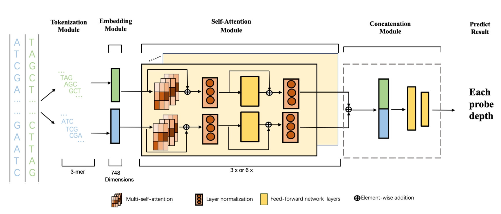

# Deqformer code 
<p align="left">
<a href="https://github.com/Deqformer/Deqformer-code/blob/main/license.txt"></a>
<a href=""></a>
<a href=""></a>
<a href=""></a>
<a href=""></a>
<a href="https://github.com/Deqformer/Deqformer-code/issues"></a>
</p>


# Requirements
------------------------
GPU is required. 
operating systems: tested on Ubuntu 18.04
cuda verison: 11.0

# Installation
It is recommended to use Anaconda/Miniconda to install python and all the required packages. 
Get the latest Miniconda3 for Linux 64-bit
```
wget https://repo.anaconda.com/miniconda/Miniconda3-latest-Linux-x86_64.sh
```
Install Miniconda3. Please follow the default installation settings. Restart the shell after installation.
```
bash Miniconda3-latest-Linux-x86_64.sh
```
Create and activate new python environment
```
conda create --name deqformer python=3.8
conda activate deqformer
```
Install required packages
```
pip install -r requirements.txt
```
# How to run the code
```
python3 main.py --mode Train  --dataroot data/SNP --log_dir logs/SNP --num_epochs 200
```